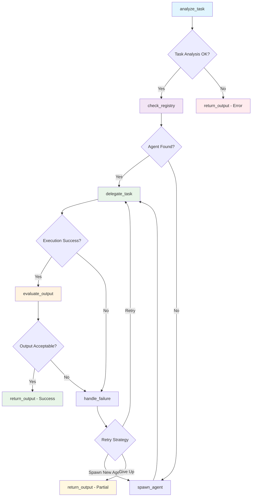

# LangGraph Workflow Visualization Guide

## Overview

This meta-agent system uses **LangGraph** and **StateGraph** to orchestrate intelligent agent selection, task delegation, and quality validation. The system provides multiple ways to visualize and monitor the workflow in real-time.

## 🏗️ Architecture

The system uses LangGraph's StateGraph to create a sophisticated workflow with:

- **7 Workflow Nodes**: Each handling a specific part of the agent orchestration process
- **4 Decision Points**: Dynamic routing based on task requirements and execution results
- **Recursive Loops**: Smart retry and escalation mechanisms
- **Agent Creation**: Dynamic spawning of specialized agents when needed

## 📊 Visualization Methods

### 1. Interactive Web Dashboard
Start the FastAPI server and access the visual dashboard:

```bash
uvicorn api.main:app --reload --host 0.0.0.0 --port 8000
```

Then visit: http://localhost:8000/workflow/dashboard

**Features:**
- Real-time Mermaid diagram rendering
- System statistics and metrics
- Agent registry status
- Modern, responsive UI

### 2. Mermaid Diagram (External)
Get the Mermaid diagram code for external visualization:

```bash
python show_mermaid.py
```

Copy the output and paste it at [mermaid.live](https://mermaid.live) for an interactive diagram.

### 3. Console Visualization
Run the comprehensive visualization demo:

```bash
python visualize_workflow.py
```

**Features:**
- Detailed workflow structure analysis
- Execution statistics
- Graph topology information
- Live workflow execution demonstration

### 4. Test Mode Visualization
Run the test suite with visualization:

```bash
python test_enhanced_system.py --viz-only  # Visualization only
python test_enhanced_system.py             # Full test with visualization
```

## 🔄 Workflow Structure

The LangGraph workflow consists of these nodes:



### Node Descriptions

| Node | Purpose | Decision Logic |
|------|---------|----------------|
| `analyze_task` | Analyzes incoming requests to understand requirements | Extracts capabilities, task type, confidence |
| `check_registry` | Searches for suitable existing agents | Matches capabilities to available agents |
| `delegate_task` | Executes the task with the chosen agent | Tracks attempts, handles execution |
| `evaluate_output` | Validates response quality and completeness | Quality scoring, issue detection |
| `handle_failure` | Manages retries and escalation strategies | Retry logic, agent switching |
| `spawn_agent` | Creates new specialized agents when needed | Dynamic agent creation with limits |
| `return_output` | Prepares and returns the final response | Result formatting, metadata collection |

### Decision Points

1. **Task Analysis OK?** - Ensures the task is properly understood
2. **Agent Found?** - Determines if existing agents can handle the task
3. **Execution Success?** - Checks if the agent completed the task
4. **Output Acceptable?** - Validates response quality
5. **Retry Strategy** - Decides how to handle failures

## 📈 Real-time Monitoring

### API Endpoints

The system exposes several visualization endpoints:

```bash
# JSON workflow data
GET /workflow/visualization

# Mermaid diagram code
GET /workflow/mermaid

# Interactive HTML dashboard
GET /workflow/dashboard
```

### Statistics Tracked

- **Agent Registry**: Available agents and their capabilities
- **Execution Metrics**: Retry counts, success rates, agent creation
- **Workflow State**: Current node, decision outcomes, recursion depth
- **Performance**: Processing times, resource usage

## 🎯 Key Features

### Dynamic Agent Creation
The system can create new specialized agents on-demand:
- **Limit**: Maximum 3 new agents per workflow execution
- **Triggers**: When existing agents can't handle the task
- **Specialization**: Agents are created with task-specific capabilities

### Smart Retry Logic
Sophisticated failure handling:
- **Per-Agent Limits**: Up to 3 attempts per agent
- **Escalation**: Creates new agents when retries fail
- **Circuit Breaker**: Prevents infinite loops with recursion limits

### Quality Validation
Every response is evaluated for:
- **Relevance**: Does it address the original query?
- **Completeness**: Is all required information included?
- **Quality**: Is the response well-structured and helpful?

## 🛠️ Usage Examples

### Basic Visualization
```python
from meta_agent.controller import MetaAgentController

controller = MetaAgentController(use_full_supervisor=True)
supervisor_graph = controller.supervisor.supervisor_graph

# Print workflow structure
supervisor_graph.print_workflow_summary()

# Get execution statistics
stats = supervisor_graph.get_execution_stats()
print(f"Available agents: {stats['available_agents']}")

# Get Mermaid diagram
mermaid = supervisor_graph.get_mermaid_diagram()
print(mermaid)
```

### Live Workflow Monitoring
```python
# Process a task and track the workflow
result = await controller.process_request(
    input_data={"query": "Your task here"}
)

print(f"Status: {result['status']}")
print(f"Agent used: {result['agent_used']}")
print(f"New agent created: {result['was_agent_created']}")
print(f"Retry count: {result['retry_count']}")
```

## 🔧 Technical Details

### StateGraph Configuration
- **Recursion Limit**: 25 (prevents infinite loops)
- **Error Handling**: Comprehensive exception management
- **State Persistence**: Maintains context across nodes
- **Conditional Routing**: Dynamic path selection based on state

### Agent Registry
- **Dynamic Registration**: Agents can be added at runtime
- **Capability Matching**: Smart agent selection based on task requirements
- **Load Balancing**: Distributes tasks across available agents

### Performance Optimizations
- **Early Termination**: Stops processing when quality threshold is met
- **Caching**: Reuses analysis results where possible
- **Resource Limits**: Prevents resource exhaustion

## 📋 Troubleshooting

### Common Issues

1. **"Full supervisor not available"**
   - Ensure `use_full_supervisor=True` in controller initialization
   - Check that all dependencies are installed

2. **"Graph visualization failed"**
   - Use fallback visualization (static node/edge list)
   - Check LangGraph installation

3. **Agent creation limits reached**
   - This is by design to prevent resource exhaustion
   - Existing agents will handle the task with retries

### Debug Mode
Enable detailed logging:
```python
import logging
logging.basicConfig(level=logging.INFO)
```

## 🚀 Future Enhancements

- **Real-time WebSocket updates** for live workflow monitoring
- **Custom node visualization** with execution timing
- **Agent performance analytics** and optimization suggestions
- **Export capabilities** for workflow analysis and reporting

---

**Note**: This visualization system provides unprecedented insight into how your meta-agent system makes decisions, handles failures, and adapts to new tasks. Use it to understand, debug, and optimize your agent workflows. 