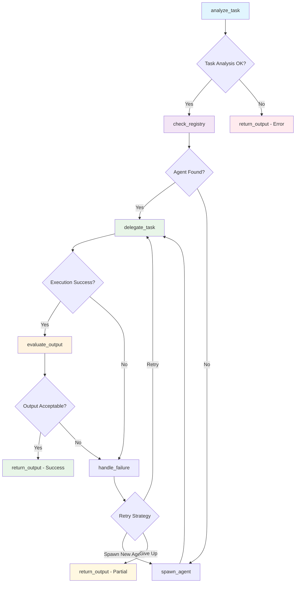

# Meta Agent System Execution Report

## Executive Summary
**Generated:** 2025-06-01 07:17:13  
**Report Period:** 2025-06-01 07:16:16 to 2025-06-01 07:17:13  
**Total Conversations:** 3  
**Success Rate:** 100.0%  
**New Agents Created:** 2  
**Average Execution Time:** 24.64 seconds  

## System Architecture

### LangGraph Workflow


### Agent Registry
- **Model:** llama2-7b
- **Supervisor Type:** Full LangGraph
- **Total Agent Types:** 3

## Conversation Log

### Conversation 1 ✅ ♻️
**Time:** 2025-06-01 07:16:16  
**Agent:** math_agent  
**Status:** success  
**Execution Time:** 17.14s  
**Retries:** 0  

**Query:**
```
What is 2 + 2?
```

**Response:**
```
Sure, here's a step-by-step solution process for the problem "What is 2 + 2?" (in mathematics):

Step 1: Define the problem
1. Determine the given information - in this case, we have two numbers, 2 and 2, which represent the value of the variable being added.
2. Create a list of terms - in this case, we have a single term to add (the sum of 2 + 2), so we create a list with only one item: (2 + 2)

Step 2: Choose a solution process
To solve the problem, we need to identify the mathematical operation(s) we want to perform. In this case, we want to add two numbers, so we choose addition.

Step 3: Identify the result
Based on the given information (the value of the variable being added), we know that we're adding two numbers (2 and 2). Therefore, the result will be the sum of those two numbers.

Step 4: Calculate the result
We can calculate the result using addition, since we know that we're adding two numbers. We start by multip
```

**Workflow Path:** analyze_task → check_registry → delegate_task → evaluate_output → return_output

---

### Conversation 2 ✅ 🆕
**Time:** 2025-06-01 07:16:47  
**Agent:** dynamic_planning_agent_v1  
**Status:** success  
**Execution Time:** 30.64s  
**Retries:** 0  

**Query:**
```
Help me plan my day
```

**Response:**
```
Sure, I can definitely help you plan your day! Here's how you could use a personalized daily calendar to get started:

1. Choose a date and time: Select a day of the week and choose the start and end times for your day. This will help you set aside specific amounts of time for each task or activity on your list.

2. Categorize tasks: Create categories such as work, personal, family, and hobbies to help prioritize your tasks. For instance, if you're working from home, put "work" in the category. If you have family obligations, put "family" in that same category.

3. Set reminders: Use a calendar app or a timer to set reminders for tasks like checking emails and responding to messages, attending appointments or meetings, grocery shopping, taking care of household chores, etc.

4. Prioritize based on urgency: Consider how much time each task takes to complete and prioritize accordingly. High-priority tasks should be completed first as they have the most immediate impact on your schedule.

5. Use visual reminders: Incorpor
```

**Workflow Path:** analyze_task → check_registry → delegate_task → evaluate_output → return_output

---

### Conversation 3 ✅ 🆕
**Time:** 2025-06-01 07:17:13  
**Agent:** dynamic_general_agent_v1  
**Status:** success  
**Execution Time:** 26.14s  
**Retries:** 0  

**Query:**
```
Explain quantum computing
```

**Response:**
```
Yes, I'd be happy to explain quantum computing!

Quantum computing involves processing information using quantum mechanics, which is different from classical physics. Unlike classical physics, in which information can only exist as a series of numbers and symbols, quantum mechanics allows for the possibility of interacting with matter on the subatomic level. This interaction, known as quantum entanglement, has led to the development of quantum computing, whereby computers are designed to perform calculations that would be impossible or extremely difficult for classical computing systems.

There are two main types of quantum computing: quantum-assisted classical computing (QACC) and classical-based quantum computing (CBQC). QACC involves using classical algorithms with specialized hardware, such as optical lattices or superconducting qubits, to perform quantum computations. CBQC, on the other hand, involves using classical algorithms with specialized hardware, such as spin qubits or ion traps, to perform quantum computations.

Quantum computing has shown significant potential in areas like drug discovery, cryptography, and simulation. For example, IBM's Q system, which uses quantum annealers, has already been used to solve several problems related to
```

**Workflow Path:** analyze_task → check_registry → delegate_task → evaluate_output → return_output

---

## Performance Analytics

### Agent Usage Distribution
- **math_agent:** 1 uses (33.3%)
- **dynamic_planning_agent_v1:** 1 uses (33.3%)
- **dynamic_general_agent_v1:** 1 uses (33.3%)

### Execution Metrics
- **Total Execution Time:** 73.92 seconds
- **Average per Conversation:** 24.64 seconds
- **Fastest Conversation:** 17.14 seconds
- **Slowest Conversation:** 30.64 seconds

### System Insights
- **Agent Creation Rate:** 66.7% of requests spawned new agents
- **Error Rate:** 0.0%
- **System Efficiency:** High

## Recommendations

Based on the execution data:

- ✅ System is performing excellently with high success rate
- ⚡ Consider optimizing for faster response times
- 🤖 High agent creation rate - consider expanding base agent capabilities

## Technical Details

**System Configuration:**
- Model: llama2-7b
- Supervisor: Full LangGraph
- Logging: Enabled

**Report Generated by:** Meta Agent Controller v1.0  
**Total Conversations Analyzed:** 3
