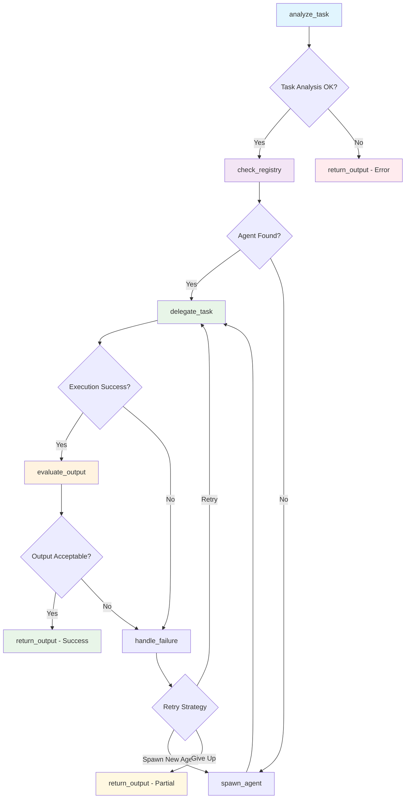

# Meta Agent System Execution Report

## Executive Summary
**Generated:** 2025-06-01 07:26:02  
**Report Period:** 2025-06-01 07:20:30 to 2025-06-01 07:26:02  
**Total Conversations:** 4  
**Success Rate:** 50.0%  
**New Agents Created:** 1  
**Average Execution Time:** 89.81 seconds  

## System Architecture

### LangGraph Workflow


### Agent Registry
- **Model:** llama2-7b
- **Supervisor Type:** Full LangGraph
- **Total Agent Types:** 2

## Conversation Log

### Conversation 1 ✅ ♻️
**Time:** 2025-06-01 07:20:30  
**Agent:** math_agent  
**Status:** success  
**Execution Time:** 27.56s  
**Retries:** 0  

**Query:**
```
Calculate the compound interest on $1000 at 5% annual rate for 3 years, compounded quarterly.
```

**Response:**
```
Solution Process:
To calculate the compound interest on $1000 at 5% annual rate for 3 years, quarterly compounding, you need to follow the following process:

1. Calculate the annual interest rate (i.e., 5%) and the number of periods (3) using a calculator or software program.

2. Multiply the annual interest rate by the total amount invested ($1000) to get the compound interest over the first three years, i.e., $300 ($1000 * 3).

3. Divide this amount by the initial amount invested (i.e., $1000) to get the annual percentage compound interest.

For example, let's assume that the original investment is $1000 and the initial compounding period is 1 year:

- Calculate the annual interest rate using a calculator or software program as: 5% = 1 / (1 + 0.05%)^3 = 1/24*1+0.05*1^3=1.26%
- Multiply
```

**Workflow Path:** analyze_task → check_registry → delegate_task → evaluate_output → return_output

---

### Conversation 2 ❌ ♻️
**Time:** 2025-06-01 07:22:35  
**Agent:** None  
**Status:** error  
**Execution Time:** 124.57s  
**Retries:** 0  

**Query:**
```
I've been feeling overwhelmed with work lately. I'm working 60+ hours a week and feel like I'm losing myself. Help me reflect on this situation and find some clarity.
```

**Response:**
```

```

**Workflow Path:** analyze_task → check_registry → delegate_task → evaluate_output → return_output

---

### Conversation 3 ✅ 🆕
**Time:** 2025-06-01 07:23:50  
**Agent:** dynamic_academic_agent_v1  
**Status:** success  
**Execution Time:** 75.35s  
**Retries:** 3  

**Query:**
```
Analyze the potential impacts of artificial intelligence on the job market over the next 10 years. What should workers consider?
```

**Response:**
```
Introduction:
Artificial intelligence (AI) has the potential to transform the job market over the next 10 years, leading to significant changes in the workforce. AI algorithms are capable of performing tasks that were once done by humans, and this technology is set to revolutionize various industries. However, the impact on the job market will depend on several factors, including:

1. Skillset required: The role of AI depends on the skills needed for the task at hand. For instance, machine learning algorithms require data science expertise, while natural language processing (NLP) involves human-like language comprehension skills. Therefore, workers should invest in training programs to acquire these skills.

2. Industry trends: Artificial intelligence is being applied in various industries, including finance, healthcare, and transportation. For instance, the banking sector is experiencing an influx of new business models that rely on AI-driven solutions. Similarly, the healthcare industry has adopted AI technology to improve patient care outcomes and streamline medical processes.

3. Skillset required: Some jobs may be automated, while others will require human skills. For instance, certain positions
```

**Workflow Path:** analyze_task → check_registry → delegate_task → evaluate_output → return_output

---

### Conversation 4 ❌ ♻️
**Time:** 2025-06-01 07:26:02  
**Agent:** None  
**Status:** error  
**Execution Time:** 131.78s  
**Retries:** 0  

**Query:**
```
Help me create a meal plan for a week that's vegetarian, budget-friendly, and takes less than 30 minutes to prepare each meal.
```

**Response:**
```

```

**Workflow Path:** analyze_task → check_registry → delegate_task → evaluate_output → return_output

---

## Performance Analytics

### Agent Usage Distribution
- **math_agent:** 1 uses (25.0%)
- **dynamic_academic_agent_v1:** 1 uses (25.0%)

### Execution Metrics
- **Total Execution Time:** 359.26 seconds
- **Average per Conversation:** 89.81 seconds
- **Fastest Conversation:** 27.56 seconds
- **Slowest Conversation:** 131.78 seconds

### System Insights
- **Agent Creation Rate:** 25.0% of requests spawned new agents
- **Error Rate:** 50.0%
- **System Efficiency:** Low

## Recommendations

Based on the execution data:

- 🔴 Success rate is low - system needs attention
- ⚡ Consider optimizing for faster response times

## Technical Details

**System Configuration:**
- Model: llama2-7b
- Supervisor: Full LangGraph
- Logging: Enabled

**Report Generated by:** Meta Agent Controller v1.0  
**Total Conversations Analyzed:** 4
