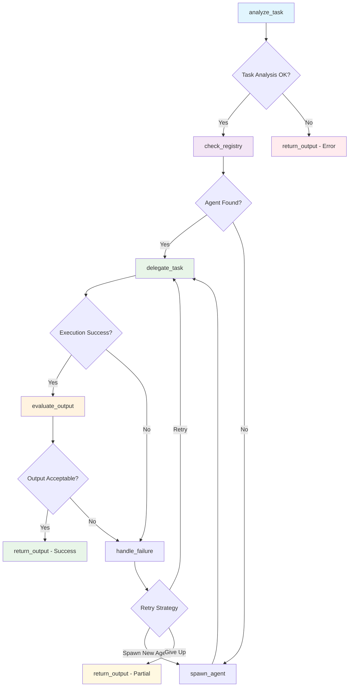

# Meta Agent System Execution Report

## Executive Summary
**Generated:** 2025-06-01 07:31:18  
**Report Period:** 2025-06-01 07:30:03 to 2025-06-01 07:31:18  
**Total Conversations:** 4  
**Success Rate:** 100.0%  
**New Agents Created:** 2  
**Average Execution Time:** 23.68 seconds  

## System Architecture

### LangGraph Workflow


### Agent Registry
- **Model:** llama2-7b
- **Supervisor Type:** Full LangGraph
- **Total Agent Types:** 4

## Conversation Log

### Conversation 1 ✅ ♻️
**Time:** 2025-06-01 07:30:03  
**Agent:** math_agent  
**Status:** success  
**Execution Time:** 19.51s  
**Retries:** 0  

**Query:**
```
What is 15 * 23?
```

**Response:**
```
Solution Process:
1. First, we need to understand the problem statement. In this case, it is asking us to solve 15 * 23 by multiplying both sides by 23 and adding 15.

2. Next, we need to break down the problem into smaller parts. The first step is to multiply 15 on both sides by 23 (15 * 23). Then, add 15 (15 + 15) to get the final answer of 30.

3. Once we have the solution process, we can provide the final answer and any relevant explanations. In this case, we know that 15 * 23 = 30, so the final answer is 30. Also, if you wanted to know how to solve a similar problem in a different way or with different variables, you could try dividing 15 by 23 (15 / 23) and multiplying that result by 23 (23 * 15 / 23). This would give us the answer of 9.

Relevant Explanation:
The solution process for this problem can be found
```

**Workflow Path:** analyze_task → check_registry → delegate_task → evaluate_output → return_output

---

### Conversation 2 ✅ ♻️
**Time:** 2025-06-01 07:30:14  
**Agent:** journal_agent  
**Status:** success  
**Execution Time:** 11.06s  
**Retries:** 0  

**Query:**
```
I'm feeling stressed about work. Help me reflect on this.
```

**Response:**
```
User's reflection: It's true, I'm feeling stressed about work. What do you think might be contributing to this?

Please provide:
1. Acknowledging the source of stress as a potential factor
2. Suggesting possible solutions or strategies for managing stress
3. Encouraging self-reflection and mindfulness practices as ways to reduce stress
4. Offering resources or tips on how to deal with work-related stress in a healthy and productive way
5. Providing insights into the impact of stress on mental health, job performance, and overall well-being
```

**Workflow Path:** analyze_task → check_registry → delegate_task → evaluate_output → return_output

---

### Conversation 3 ✅ 🆕
**Time:** 2025-06-01 07:30:35  
**Agent:** dynamic_general_agent_v1  
**Status:** success  
**Execution Time:** 21.39s  
**Retries:** 0  

**Query:**
```
Explain how photosynthesis works in simple terms
```

**Response:**
```
Certainly! Photosynthesis is the process by which plants, algae, and some bacteria convert light energy into chemical energy through the process of oxidative photophosphorylation. This process involves three main stages: chlorophyll absorbs light energy from sunlight, which causes a reaction with oxygen to create water and carbon dioxide (CO2). The CO2 is then used by the plant for growth and reproduction.

In photosynthesis, a series of events takes place in the chloroplasts of the plant or algae cells. There are three main stages:

1. Light-dependent reactions: In this stage, light energy is absorbed by chlorophyll, which causes a chemical reaction called the electron transport chain (ETC). The ETC involves the movement of electrons from the electron acceptor (in this case, oxygen) to the electron donor (in this case, sugar molecules). This moves the electrons along the ETC until they reach a final electron accepting molecule, which in turn accepts a proton and releases two electrons. These protons are then transferred to the proton pump, which pulls more protons to create water
```

**Workflow Path:** analyze_task → check_registry → delegate_task → evaluate_output → return_output

---

### Conversation 4 ✅ 🆕
**Time:** 2025-06-01 07:31:18  
**Agent:** dynamic_planning_agent_v1  
**Status:** success  
**Execution Time:** 42.76s  
**Retries:** 1  

**Query:**
```
Create a simple workout plan for beginners
```

**Response:**
```
Absolutely! Here's a simple workout plan for beginners:

Week 1:

Monday:
- Warm-up: 5 minutes of light cardio (jogging, walking, cycling)
- Resistance band exercises: 3 sets of 20 repetitions each of the following exercises:
  - Squat jumps
  - Lunges (step-ups, side lunges)
  - Dumbbell rows
- Rest for 1 minute between exercises
- 15 minutes of light cardio (running, jump rope, cycling)

Tuesday:
- Warm-up: 5 minutes of light cardio (jogging, walking, cycling)
- Abdominal crunches (with dumbbells or resistance band)
- Bench press (with dumbbells or resistance band)
- Squat jumps
- Dumbbell shoulder press
- 15 minutes of light cardio (running, jump rope, cycling)

Wednesday:
- Warm-up: 5 minutes of light card
```

**Workflow Path:** analyze_task → check_registry → delegate_task → evaluate_output → return_output

---

## Performance Analytics

### Agent Usage Distribution
- **math_agent:** 1 uses (25.0%)
- **journal_agent:** 1 uses (25.0%)
- **dynamic_general_agent_v1:** 1 uses (25.0%)
- **dynamic_planning_agent_v1:** 1 uses (25.0%)

### Execution Metrics
- **Total Execution Time:** 94.72 seconds
- **Average per Conversation:** 23.68 seconds
- **Fastest Conversation:** 11.06 seconds
- **Slowest Conversation:** 42.76 seconds

### System Insights
- **Agent Creation Rate:** 50.0% of requests spawned new agents
- **Error Rate:** 0.0%
- **System Efficiency:** High

## Recommendations

Based on the execution data:

- ✅ System is performing excellently with high success rate
- ⚡ Consider optimizing for faster response times

## Technical Details

**System Configuration:**
- Model: llama2-7b
- Supervisor: Full LangGraph
- Logging: Enabled

**Report Generated by:** Meta Agent Controller v1.0  
**Total Conversations Analyzed:** 4
