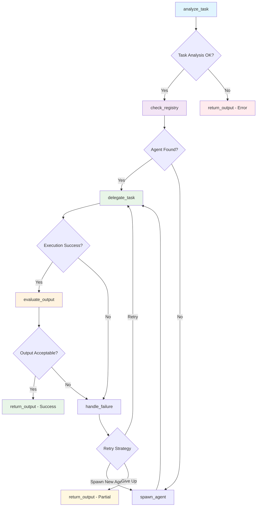

# Meta Agent System Execution Report

## Executive Summary
**Generated:** 2025-06-01 08:23:54  
**Report Period:** 2025-06-01 08:23:54 to 2025-06-01 08:23:54  
**Total Conversations:** 1  
**Success Rate:** 100.0%  
**New Agents Created:** 0  
**Average Execution Time:** 17.02 seconds  

## System Architecture

### LangGraph Workflow


### Agent Registry
- **Model:** tinyllama
- **Supervisor Type:** Full LangGraph
- **Total Agent Types:** 1

## Conversation Log

### Conversation 1 ✅ ♻️
**Time:** 2025-06-01 08:23:54  
**Agent:** math_agent  
**Status:** success  
**Execution Time:** 17.02s  
**Retries:** 0  

**Query:**
```
What is 15 * 23?
```

**Response:**
```
Step-by-Step Solution Process:
1. Firstly, check if the given input is valid. In this case, we have 15 and 23 as inputs.

2. Divide both inputs by each other (i.e., 15 / 23 = 0.5) to get the common factor: 5

3. Multiply the result by 23 (i.e., 5 * 23 = 150) to get the product: 150

4. Finally, add 15 and the resulting product to get the final answer: 15 + 150 = 165

Explanations:
- The input numbers (i.e., 15 and 23) are divided by each other to get a common factor of 5. This is because both numbers are even (i.e., divisible by 2).
- The result is multiplied by 23 to obtain the product.
- Finally, the addition of the resulting product with the original inputs gives us the final answer, which is 165.
```

**Workflow Path:** analyze_task → check_registry → delegate_task → evaluate_output → return_output

---

## Performance Analytics

### Agent Usage Distribution
- **math_agent:** 1 uses (100.0%)

### Execution Metrics
- **Total Execution Time:** 17.02 seconds
- **Average per Conversation:** 17.02 seconds
- **Fastest Conversation:** 17.02 seconds
- **Slowest Conversation:** 17.02 seconds

### System Insights
- **Agent Creation Rate:** 0.0% of requests spawned new agents
- **Error Rate:** 0.0%
- **System Efficiency:** High

## Recommendations

Based on the execution data:

- ✅ System is performing excellently with high success rate
- ⚡ Consider optimizing for faster response times

## Technical Details

**System Configuration:**
- Model: tinyllama
- Supervisor: Full LangGraph
- Logging: Enabled

**Report Generated by:** Meta Agent Controller v1.0  
**Total Conversations Analyzed:** 1
