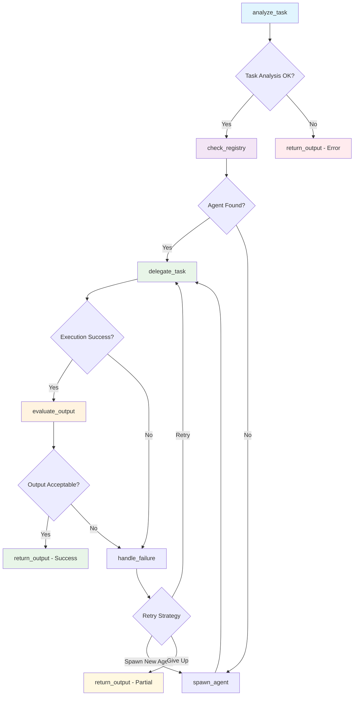

# Meta Agent System Execution Report

## Executive Summary
**Generated:** 2025-06-01 08:48:48  
**Report Period:** 2025-06-01 08:48:48 to 2025-06-01 08:48:48  
**Total Conversations:** 1  
**Success Rate:** 100.0%  
**New Agents Created:** 0  
**Average Execution Time:** 15.30 seconds  

## System Architecture

### LangGraph Workflow


### Agent Registry
- **Model:** tinyllama
- **Supervisor Type:** Full LangGraph
- **Total Agent Types:** 1

## Conversation Log

### Conversation 1 ✅ ♻️
**Time:** 2025-06-01 08:48:48  
**Agent:** math_agent  
**Status:** success  
**Execution Time:** 15.30s  
**Retries:** 0  

**Query:**
```
what is 1+1
```

**Response:**
```
Solution Process:
1. Firstly, we need to understand what the given problem is asking for. In this case, it's "what is 1+1".
2. To solve this problem, we can use the following steps:
   a. Identify the given statement or instruction: "what is 1+1"
   b. Break down the problem into component parts:
      - 1 (single number)
      - + (operator)
      - 1
      - = (equals sign)
   c. Repeat each step until the solution is obtained:
     - Identify a single number in the given statement: 1
     - Identify an operator ("+" or "-") to use for this problem: "+", which means "add"
     - Identify a single number in the operation (e.g., "+1"), which will be the answer to this problem

Final Answer:
The final answer is: 2 (two)

Relevant Explanation:
The given statement or instruction asks for a single number ("1+1") and an operator to perform the addition (or subtraction, in this case). The solution process involves ident
```

**Workflow Path:** analyze_task → check_registry → delegate_task → evaluate_output → return_output

---

## Performance Analytics

### Agent Usage Distribution
- **math_agent:** 1 uses (100.0%)

### Execution Metrics
- **Total Execution Time:** 15.30 seconds
- **Average per Conversation:** 15.30 seconds
- **Fastest Conversation:** 15.30 seconds
- **Slowest Conversation:** 15.30 seconds

### System Insights
- **Agent Creation Rate:** 0.0% of requests spawned new agents
- **Error Rate:** 0.0%
- **System Efficiency:** High

## Recommendations

Based on the execution data:

- ✅ System is performing excellently with high success rate
- ⚡ Consider optimizing for faster response times

## Technical Details

**System Configuration:**
- Model: tinyllama
- Supervisor: Full LangGraph
- Logging: Enabled

**Report Generated by:** Meta Agent Controller v1.0  
**Total Conversations Analyzed:** 1
