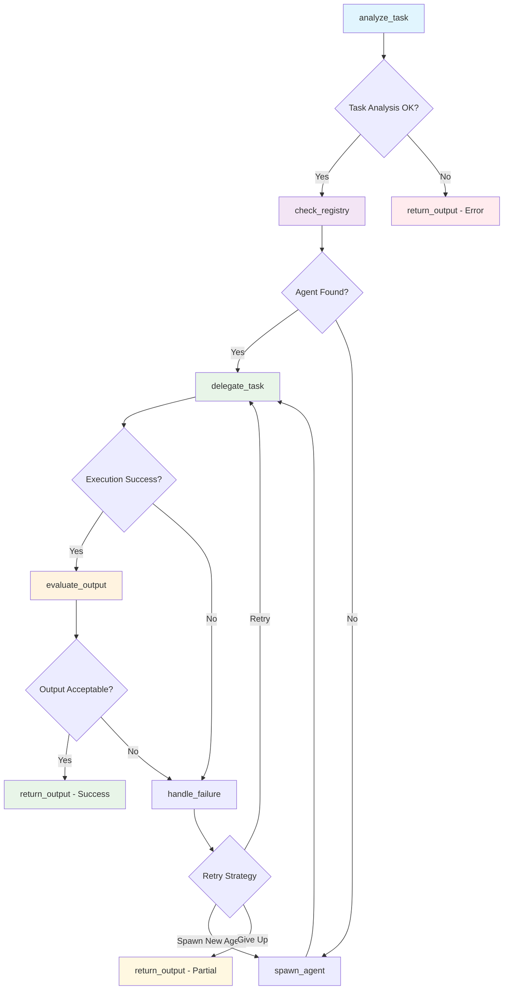

# Meta Agent System Execution Report

## Executive Summary
**Generated:** 2025-06-01 10:35:27  
**Report Period:** 2025-06-01 10:35:27 to 2025-06-01 10:35:27  
**Total Conversations:** 1  
**Success Rate:** 100.0%  
**New Agents Created:** 1  
**Average Execution Time:** 6.90 seconds  

## System Architecture

### LangGraph Workflow


### Agent Registry
- **Model:** tinyllama
- **Supervisor Type:** Full LangGraph
- **Total Agent Types:** 1

## Conversation Log

### Conversation 1 ✅ 🆕
**Time:** 2025-06-01 10:35:27  
**Agent:** dynamic_general_agent_v1  
**Status:** success  
**Execution Time:** 6.90s  
**Retries:** 0  

**Query:**
```
True or false: The Great Wall of China is visible from space
```

**Response:**
```
Answer: False

The Great Wall of China is not visible from space, as it is built on mountain ranges that block most views of the wall. The wall is a UNESCO World Heritage site and has been featured in several movies and TV shows. However, if you're looking for a less crowded view of the wall, there are several satellite images available online that provide a similar view as from space.
```

**Workflow Path:** analyze_task → check_registry → delegate_task → evaluate_output → return_output

---

## Performance Analytics

### Agent Usage Distribution
- **dynamic_general_agent_v1:** 1 uses (100.0%)

### Execution Metrics
- **Total Execution Time:** 6.90 seconds
- **Average per Conversation:** 6.90 seconds
- **Fastest Conversation:** 6.90 seconds
- **Slowest Conversation:** 6.90 seconds

### System Insights
- **Agent Creation Rate:** 100.0% of requests spawned new agents
- **Error Rate:** 0.0%
- **System Efficiency:** High

## Recommendations

Based on the execution data:

- ✅ System is performing excellently with high success rate
- ⚡ Consider optimizing for faster response times
- 🤖 High agent creation rate - consider expanding base agent capabilities

## Technical Details

**System Configuration:**
- Model: tinyllama
- Supervisor: Full LangGraph
- Logging: Enabled

**Report Generated by:** Meta Agent Controller v1.0  
**Total Conversations Analyzed:** 1
