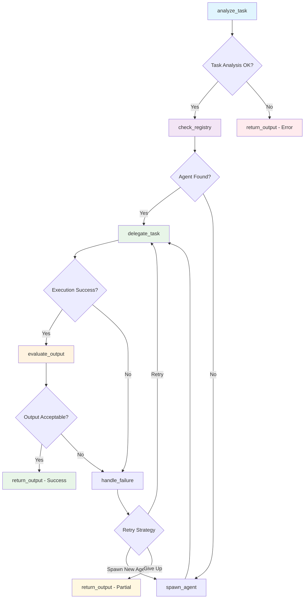

# Meta Agent System Execution Report

## Executive Summary
**Generated:** 2025-06-01 10:36:52  
**Report Period:** 2025-06-01 10:36:52 to 2025-06-01 10:36:52  
**Total Conversations:** 1  
**Success Rate:** 100.0%  
**New Agents Created:** 0  
**Average Execution Time:** 4.08 seconds  

## System Architecture

### LangGraph Workflow


### Agent Registry
- **Model:** tinyllama
- **Supervisor Type:** Full LangGraph
- **Total Agent Types:** 1

## Conversation Log

### Conversation 1 ✅ ♻️
**Time:** 2025-06-01 10:36:52  
**Agent:** fun_fact_agent  
**Status:** success  
**Execution Time:** 4.08s  
**Retries:** 0  

**Query:**
```
True or false: The Great Wall of China is visible from space
```

**Response:**
```
Response: False. The Great Wall of China is not visible from space due to its location, as it is built on a mountain range and is covered in trees and vegetation. Its walls are too steep and too narrow for satellites to capture a clear image of the wall's structure.
```

**Workflow Path:** analyze_task → check_registry → delegate_task → evaluate_output → return_output

---

## Performance Analytics

### Agent Usage Distribution
- **fun_fact_agent:** 1 uses (100.0%)

### Execution Metrics
- **Total Execution Time:** 4.08 seconds
- **Average per Conversation:** 4.08 seconds
- **Fastest Conversation:** 4.08 seconds
- **Slowest Conversation:** 4.08 seconds

### System Insights
- **Agent Creation Rate:** 0.0% of requests spawned new agents
- **Error Rate:** 0.0%
- **System Efficiency:** High

## Recommendations

Based on the execution data:

- ✅ System is performing excellently with high success rate

## Technical Details

**System Configuration:**
- Model: tinyllama
- Supervisor: Full LangGraph
- Logging: Enabled

**Report Generated by:** Meta Agent Controller v1.0  
**Total Conversations Analyzed:** 1
