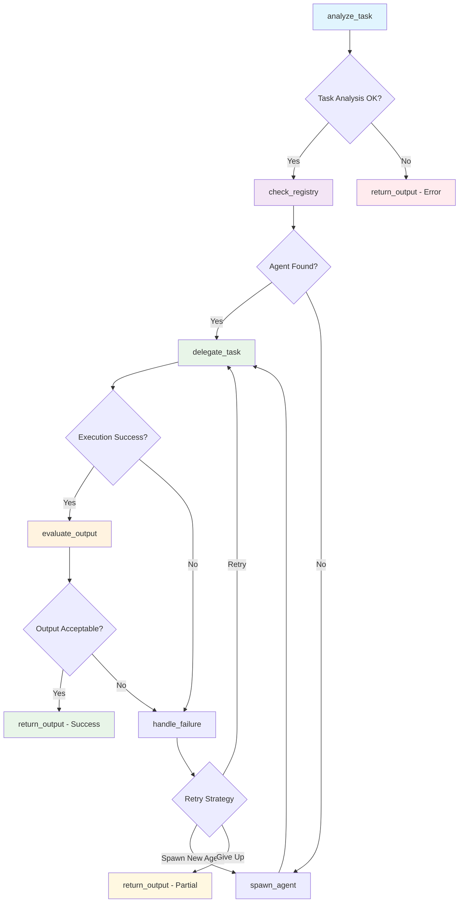

# Meta Agent System Execution Report

## Executive Summary
**Generated:** 2025-06-01 10:37:22  
**Report Period:** 2025-06-01 10:37:22 to 2025-06-01 10:37:22  
**Total Conversations:** 1  
**Success Rate:** 100.0%  
**New Agents Created:** 0  
**Average Execution Time:** 10.51 seconds  

## System Architecture

### LangGraph Workflow


### Agent Registry
- **Model:** tinyllama
- **Supervisor Type:** Full LangGraph
- **Total Agent Types:** 1

## Conversation Log

### Conversation 1 ✅ ♻️
**Time:** 2025-06-01 10:37:22  
**Agent:** math_agent  
**Status:** success  
**Execution Time:** 10.51s  
**Retries:** 0  

**Query:**
```
What is 25 * 17?
```

**Response:**
```
Sure! To get the result 25 * 17, you need to first multiply 25 and 17 together:

25 * 17 = 409

Then, divide both sides by 17 (since 17 is a common denominator):

25 / 17 = 1.6

Finally, you can multiply 1.6 with each side to get the final answer:

25 * 1.6 = 409 * 1.6 = 684.6

So, the result is: 25 * 17 = 684.6.
```

**Workflow Path:** analyze_task → check_registry → delegate_task → evaluate_output → return_output

---

## Performance Analytics

### Agent Usage Distribution
- **math_agent:** 1 uses (100.0%)

### Execution Metrics
- **Total Execution Time:** 10.51 seconds
- **Average per Conversation:** 10.51 seconds
- **Fastest Conversation:** 10.51 seconds
- **Slowest Conversation:** 10.51 seconds

### System Insights
- **Agent Creation Rate:** 0.0% of requests spawned new agents
- **Error Rate:** 0.0%
- **System Efficiency:** High

## Recommendations

Based on the execution data:

- ✅ System is performing excellently with high success rate
- ⚡ Consider optimizing for faster response times

## Technical Details

**System Configuration:**
- Model: tinyllama
- Supervisor: Full LangGraph
- Logging: Enabled

**Report Generated by:** Meta Agent Controller v1.0  
**Total Conversations Analyzed:** 1
