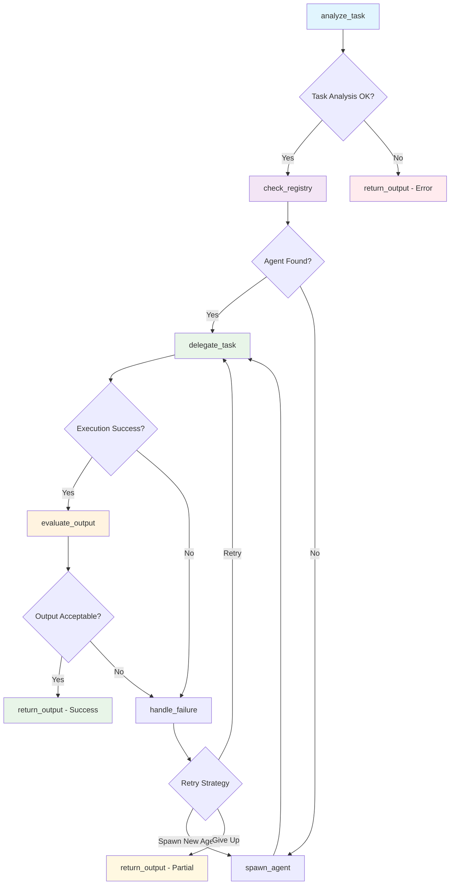

# Meta Agent System Execution Report

## Executive Summary
**Generated:** 2025-06-01 11:01:38  
**Report Period:** 2025-06-01 11:01:38 to 2025-06-01 11:01:38  
**Total Conversations:** 1  
**Success Rate:** 100.0%  
**New Agents Created:** 1  
**Average Execution Time:** 8.80 seconds  

## System Architecture

### LangGraph Workflow


### Agent Registry
- **Model:** tinyllama
- **Supervisor Type:** Full LangGraph
- **Total Agent Types:** 1

## Conversation Log

### Conversation 1 ✅ 🆕
**Time:** 2025-06-01 11:01:38  
**Agent:** dynamic_general_agent_v1  
**Status:** success  
**Execution Time:** 8.80s  
**Retries:** 0  

**Query:**
```
Is the Great Wall of China longer than 1000 miles?
```

**Response:**
```
No, the Great Wall of China is not considered to be a continuous wall stretching over 1000 miles long. The Great Wall was built in various sections over different periods, with some sections being shorter than others. As for the total length, it is estimated that the Great Wall stretches around 2,700 kilometers (1,742 miles), covering about 90% of China's territory.
```

**Workflow Path:** analyze_task → check_registry → delegate_task → evaluate_output → return_output

---

## Performance Analytics

### Agent Usage Distribution
- **dynamic_general_agent_v1:** 1 uses (100.0%)

### Execution Metrics
- **Total Execution Time:** 8.80 seconds
- **Average per Conversation:** 8.80 seconds
- **Fastest Conversation:** 8.80 seconds
- **Slowest Conversation:** 8.80 seconds

### System Insights
- **Agent Creation Rate:** 100.0% of requests spawned new agents
- **Error Rate:** 0.0%
- **System Efficiency:** High

## Recommendations

Based on the execution data:

- ✅ System is performing excellently with high success rate
- ⚡ Consider optimizing for faster response times
- 🤖 High agent creation rate - consider expanding base agent capabilities

## Technical Details

**System Configuration:**
- Model: tinyllama
- Supervisor: Full LangGraph
- Logging: Enabled

**Report Generated by:** Meta Agent Controller v1.0  
**Total Conversations Analyzed:** 1
