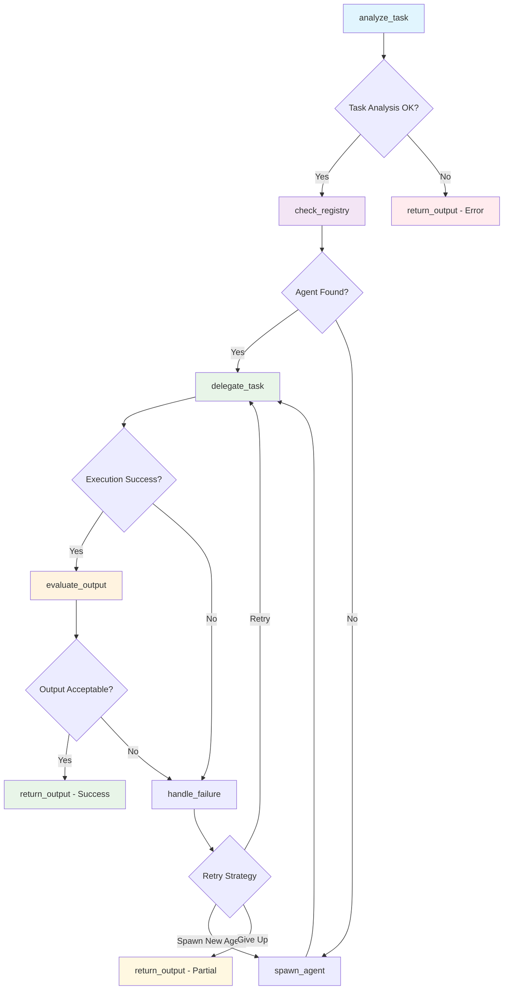

# Meta Agent System Execution Report

## Executive Summary
**Generated:** 2025-06-01 11:02:27  
**Report Period:** 2025-06-01 11:02:27 to 2025-06-01 11:02:27  
**Total Conversations:** 1  
**Success Rate:** 100.0%  
**New Agents Created:** 0  
**Average Execution Time:** 13.49 seconds  

## System Architecture

### LangGraph Workflow


### Agent Registry
- **Model:** tinyllama
- **Supervisor Type:** Full LangGraph
- **Total Agent Types:** 1

## Conversation Log

### Conversation 1 ✅ ♻️
**Time:** 2025-06-01 11:02:27  
**Agent:** fun_fact_agent  
**Status:** success  
**Execution Time:** 13.49s  
**Retries:** 0  

**Query:**
```
Is the Great Wall of China longer than 1000 miles?
```

**Response:**
```
Yes, according to some sources, the Great Wall of China is said to be about 16,500 miles (26,374 km) long. The actual distance may vary depending on how far you include the various segments and landings along the wall's length. However, most historians agree that it is the longest ancient fortification in the world, stretching from Beijing to Tiananmen Square in northwest China's Shaanxi Province. The wall was built over a period of several centuries, starting around 90 AD and lasting until the 17th century AD, covering a total length of about 3,700 miles (6,000 km).
```

**Workflow Path:** analyze_task → check_registry → delegate_task → evaluate_output → return_output

---

## Performance Analytics

### Agent Usage Distribution
- **fun_fact_agent:** 1 uses (100.0%)

### Execution Metrics
- **Total Execution Time:** 13.49 seconds
- **Average per Conversation:** 13.49 seconds
- **Fastest Conversation:** 13.49 seconds
- **Slowest Conversation:** 13.49 seconds

### System Insights
- **Agent Creation Rate:** 0.0% of requests spawned new agents
- **Error Rate:** 0.0%
- **System Efficiency:** High

## Recommendations

Based on the execution data:

- ✅ System is performing excellently with high success rate
- ⚡ Consider optimizing for faster response times

## Technical Details

**System Configuration:**
- Model: tinyllama
- Supervisor: Full LangGraph
- Logging: Enabled

**Report Generated by:** Meta Agent Controller v1.0  
**Total Conversations Analyzed:** 1
