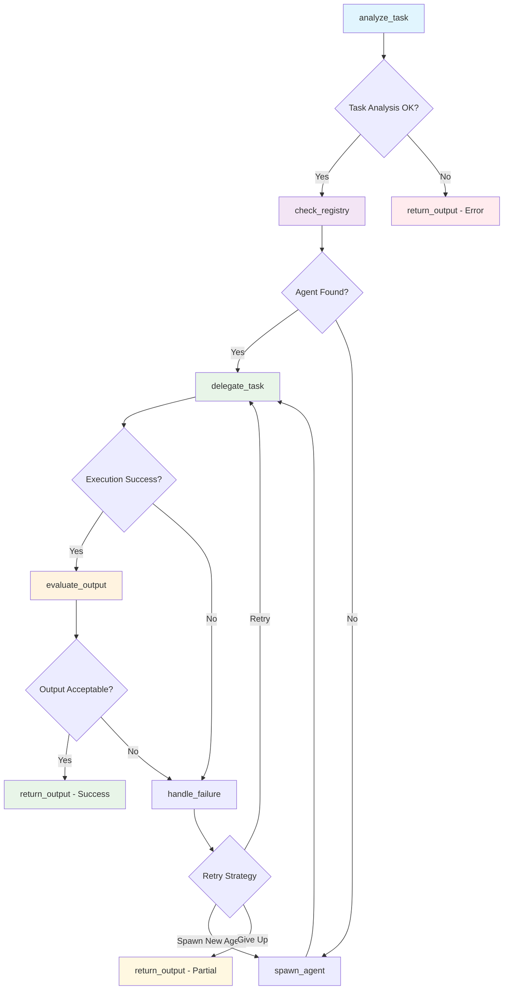

# Meta Agent System Execution Report

## Executive Summary
**Generated:** 2025-06-01 11:03:30  
**Report Period:** 2025-06-01 11:03:30 to 2025-06-01 11:03:30  
**Total Conversations:** 1  
**Success Rate:** 100.0%  
**New Agents Created:** 1  
**Average Execution Time:** 8.92 seconds  

## System Architecture

### LangGraph Workflow


### Agent Registry
- **Model:** tinyllama
- **Supervisor Type:** Full LangGraph
- **Total Agent Types:** 1

## Conversation Log

### Conversation 1 ✅ 🆕
**Time:** 2025-06-01 11:03:30  
**Agent:** dynamic_general_agent_v1  
**Status:** success  
**Execution Time:** 8.92s  
**Retries:** 0  

**Query:**
```
Do elephants have good memory?
```

**Response:**
```
Sure, I'd be happy to answer your question! Elephants are known for their strong memories and ability to recall past events. They have been observed re-creating scenes from childhood and learning new skills based on experiences they had in the past. Additionally, elephants can hold onto information for a long time, which could help them to avoid danger or remember important social cues. In general, elephants' memories are considered exceptional compared to those of other animals due to their complex cognitive abilities and the amount of information they process at a single time.
```

**Workflow Path:** analyze_task → check_registry → delegate_task → evaluate_output → return_output

---

## Performance Analytics

### Agent Usage Distribution
- **dynamic_general_agent_v1:** 1 uses (100.0%)

### Execution Metrics
- **Total Execution Time:** 8.92 seconds
- **Average per Conversation:** 8.92 seconds
- **Fastest Conversation:** 8.92 seconds
- **Slowest Conversation:** 8.92 seconds

### System Insights
- **Agent Creation Rate:** 100.0% of requests spawned new agents
- **Error Rate:** 0.0%
- **System Efficiency:** High

## Recommendations

Based on the execution data:

- ✅ System is performing excellently with high success rate
- ⚡ Consider optimizing for faster response times
- 🤖 High agent creation rate - consider expanding base agent capabilities

## Technical Details

**System Configuration:**
- Model: tinyllama
- Supervisor: Full LangGraph
- Logging: Enabled

**Report Generated by:** Meta Agent Controller v1.0  
**Total Conversations Analyzed:** 1
