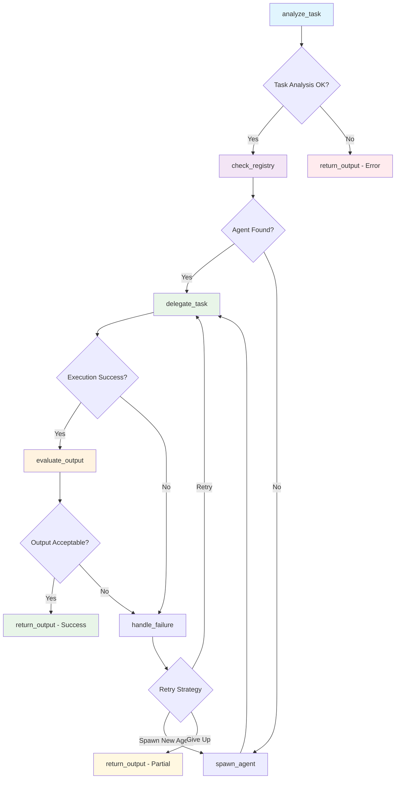

# Meta Agent System Execution Report

## Executive Summary
**Generated:** 2025-06-01 11:04:39  
**Report Period:** 2025-06-01 11:04:39 to 2025-06-01 11:04:39  
**Total Conversations:** 1  
**Success Rate:** 100.0%  
**New Agents Created:** 0  
**Average Execution Time:** 16.77 seconds  

## System Architecture

### LangGraph Workflow


### Agent Registry
- **Model:** tinyllama
- **Supervisor Type:** Full LangGraph
- **Total Agent Types:** 1

## Conversation Log

### Conversation 1 ✅ ♻️
**Time:** 2025-06-01 11:04:39  
**Agent:** fun_fact_agent  
**Status:** success  
**Execution Time:** 16.77s  
**Retries:** 0  

**Query:**
```
Do elephants have good memory?
```

**Response:**
```
Yes, elephants possess excellent memory due to their strong neurological system and the complexity of their cognitive abilities. They are known for their ability to remember information from multiple sources, such as past experiences or training sessions, and they can recall information even after being separated from their owners.

Elephants have been observed practicing memory exercises in captivity, such as associating a sound with a particular location or object. This allows them to retrieve these associations later on when exposed to the same stimulus in natural environments. 

Additionally, studies have shown that elephants can retain information for several weeks or even months, depending on their age and training schedule. The long-term memory of elephants is one of their most impressive cognitive abilities, allowing them to navigate complex social hierarchies, communicate with each other in a nonverbal manner, and maintain relationships with humans over long periods of time.
```

**Workflow Path:** analyze_task → check_registry → delegate_task → evaluate_output → return_output

---

## Performance Analytics

### Agent Usage Distribution
- **fun_fact_agent:** 1 uses (100.0%)

### Execution Metrics
- **Total Execution Time:** 16.77 seconds
- **Average per Conversation:** 16.77 seconds
- **Fastest Conversation:** 16.77 seconds
- **Slowest Conversation:** 16.77 seconds

### System Insights
- **Agent Creation Rate:** 0.0% of requests spawned new agents
- **Error Rate:** 0.0%
- **System Efficiency:** High

## Recommendations

Based on the execution data:

- ✅ System is performing excellently with high success rate
- ⚡ Consider optimizing for faster response times

## Technical Details

**System Configuration:**
- Model: tinyllama
- Supervisor: Full LangGraph
- Logging: Enabled

**Report Generated by:** Meta Agent Controller v1.0  
**Total Conversations Analyzed:** 1
