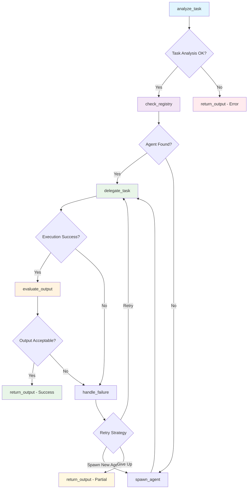

# Meta Agent System Execution Report

## Executive Summary
**Generated:** 2025-06-01 11:05:57  
**Report Period:** 2025-06-01 10:25:11 to 2025-06-01 10:25:11  
**Total Conversations:** 1  
**Success Rate:** 100.0%  
**New Agents Created:** 1  
**Average Execution Time:** 15.33 seconds  

## System Architecture

### LangGraph Workflow


### Agent Registry
- **Model:** tinyllama
- **Supervisor Type:** Full LangGraph
- **Total Agent Types:** 1

## Conversation Log

### Conversation 1 ✅ 🆕
**Time:** 2025-06-01 10:25:11  
**Agent:** dynamic_general_agent_v1  
**Status:** success  
**Execution Time:** 15.33s  
**Retries:** 0  

**Query:**
```
i need you to help me make a grocery list. i like tasty food along with eating healthy
```

**Response:**
```
As an AI assistant, I can provide you with the following grocery list for healthy and delicious food:

1. Non-dairy milk (such as almond or soy)
2. Whole grain pasta or brown rice
3. Lean protein (such as chicken, turkey, or fish)
4. Fruits and vegetables (such as berries, spinach, and leafy greens)
5. Hummus (for dipping)
6. Nuts and seeds (such as almonds, pumpkin seeds, and sunflower seeds)
7. Low-fat cheese (such as Brie or feta)
8. Avocado (for topping on salads)
9. Greek yogurt (for topping on bowls)
10. Vegetable soup (made with fresh vegetables and whole grains)
11. Dairy-free yogurt (such as silk or soy)
12. Salsa (for dipping chips)
13. Greek salad (with grilled chicken or tofu)
14.
```

**Workflow Path:** analyze_task → check_registry → delegate_task → evaluate_output → return_output

---

## Performance Analytics

### Agent Usage Distribution
- **dynamic_general_agent_v1:** 1 uses (100.0%)

### Execution Metrics
- **Total Execution Time:** 15.33 seconds
- **Average per Conversation:** 15.33 seconds
- **Fastest Conversation:** 15.33 seconds
- **Slowest Conversation:** 15.33 seconds

### System Insights
- **Agent Creation Rate:** 100.0% of requests spawned new agents
- **Error Rate:** 0.0%
- **System Efficiency:** High

## Recommendations

Based on the execution data:

- ✅ System is performing excellently with high success rate
- ⚡ Consider optimizing for faster response times
- 🤖 High agent creation rate - consider expanding base agent capabilities

## Technical Details

**System Configuration:**
- Model: tinyllama
- Supervisor: Full LangGraph
- Logging: Enabled

**Report Generated by:** Meta Agent Controller v1.0  
**Total Conversations Analyzed:** 1
