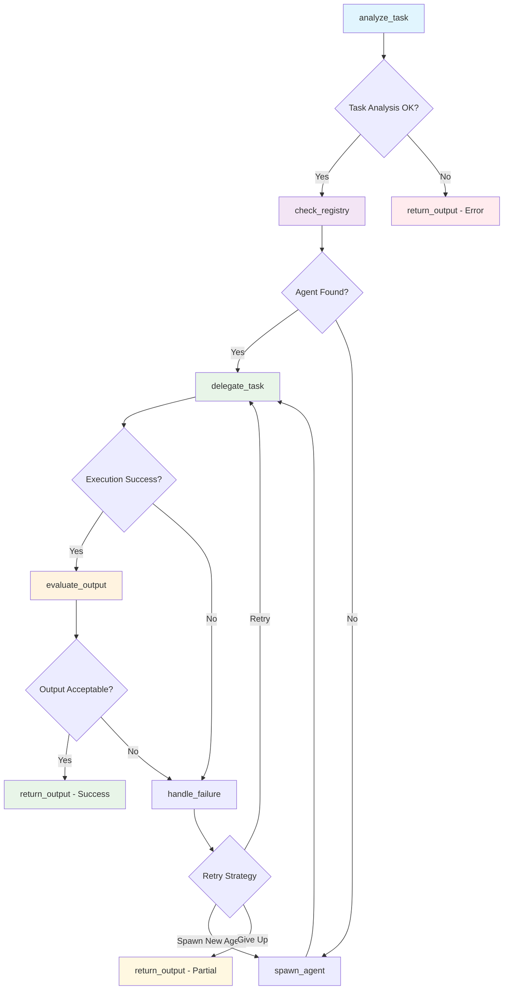

# Meta Agent System Execution Report

## Executive Summary
**Generated:** 2025-06-01 11:08:39  
**Report Period:** 2025-06-01 11:08:39 to 2025-06-01 11:08:39  
**Total Conversations:** 1  
**Success Rate:** 100.0%  
**New Agents Created:** 0  
**Average Execution Time:** 24.27 seconds  

## System Architecture

### LangGraph Workflow


### Agent Registry
- **Model:** tinyllama
- **Supervisor Type:** Full LangGraph
- **Total Agent Types:** 1

## Conversation Log

### Conversation 1 ✅ ♻️
**Time:** 2025-06-01 11:08:39  
**Agent:** math_agent  
**Status:** success  
**Execution Time:** 24.27s  
**Retries:** 1  

**Query:**
```
What is 25 * 17?
```

**Response:**
```
Sure! To get the result for the multiplication of numbers 25 and 17, you can use the following formula:

1. Multiply 25 (the first number) by 17 (the second number):

Result = 25 * 17

2. Subtract 25 from 25 * 17:

Result = 0 - (25 * 17)

3. Divide the result by 25:

Result / 25 = (17 / 25) * 25

4. Multiply the result by 25:

Result * 25 = (17 * 0) + (17 / 25) * 25

5. Finally, add 17 to the result:

Result + 17 = 32 (the final value)

Hope this helps! Let me know if you have any other queries.
```

**Workflow Path:** analyze_task → check_registry → delegate_task → evaluate_output → return_output

---

## Performance Analytics

### Agent Usage Distribution
- **math_agent:** 1 uses (100.0%)

### Execution Metrics
- **Total Execution Time:** 24.27 seconds
- **Average per Conversation:** 24.27 seconds
- **Fastest Conversation:** 24.27 seconds
- **Slowest Conversation:** 24.27 seconds

### System Insights
- **Agent Creation Rate:** 0.0% of requests spawned new agents
- **Error Rate:** 0.0%
- **System Efficiency:** High

## Recommendations

Based on the execution data:

- ✅ System is performing excellently with high success rate
- ⚡ Consider optimizing for faster response times

## Technical Details

**System Configuration:**
- Model: tinyllama
- Supervisor: Full LangGraph
- Logging: Enabled

**Report Generated by:** Meta Agent Controller v1.0  
**Total Conversations Analyzed:** 1
