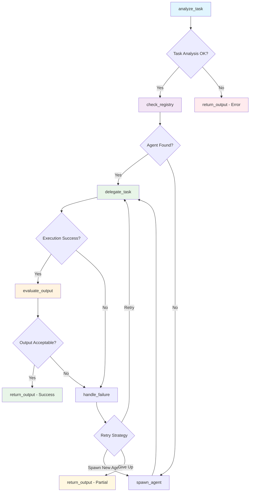

# Meta Agent System Execution Report

## Executive Summary
**Generated:** 2025-06-01 11:23:33  
**Report Period:** 2025-06-01 11:23:24 to 2025-06-01 11:23:24  
**Total Conversations:** 1  
**Success Rate:** 100.0%  
**New Agents Created:** 1  
**Average Execution Time:** 24.33 seconds  

## System Architecture

### LangGraph Workflow


### Agent Registry
- **Model:** tinyllama
- **Supervisor Type:** Full LangGraph
- **Total Agent Types:** 1

## Conversation Log

### Conversation 1 ✅ 🆕
**Time:** 2025-06-01 11:23:24  
**Agent:** dynamic_planning_agent_v1  
**Status:** success  
**Execution Time:** 24.33s  
**Retries:** 0  

**Query:**
```
please make a schedule for my workouts for this week
```

**Response:**
```
Dear [Name],

As a professional and well-informed AI assistant, I am happy to help you with your query regarding scheduling your workouts for this week. Here are some suggested workout plans that you can follow based on your availability and fitness goals:

Week 1 (Monday through Friday):
Day 1 - Monday: Bodyweight circuit training (30 minutes)
Wednesday - Friday: Yoga (20 minutes)

Week 2 (Monday through Saturday):
Day 1 - Monday: High-intensity interval training (HIIT) (45 minutes)
Tuesday - Thursday: Bodyweight circuit training (30 minutes)
Friday - Sunday: Yoga (20 minutes)

Note that these schedules may vary based on your specific fitness goals, workload, and availability. If you have any questions or concerns, don't hesitate to reach out to me for further assistance. I am here to help and support you in achieving your fitness goals. Thank you for choosing me as your AI assistant! Best regards,

[Your Name]
```

**Workflow Path:** analyze_task → check_registry → delegate_task → evaluate_output → return_output

---

## Performance Analytics

### Agent Usage Distribution
- **dynamic_planning_agent_v1:** 1 uses (100.0%)

### Execution Metrics
- **Total Execution Time:** 24.33 seconds
- **Average per Conversation:** 24.33 seconds
- **Fastest Conversation:** 24.33 seconds
- **Slowest Conversation:** 24.33 seconds

### System Insights
- **Agent Creation Rate:** 100.0% of requests spawned new agents
- **Error Rate:** 0.0%
- **System Efficiency:** High

## Recommendations

Based on the execution data:

- ✅ System is performing excellently with high success rate
- ⚡ Consider optimizing for faster response times
- 🤖 High agent creation rate - consider expanding base agent capabilities

## Technical Details

**System Configuration:**
- Model: tinyllama
- Supervisor: Full LangGraph
- Logging: Enabled

**Report Generated by:** Meta Agent Controller v1.0  
**Total Conversations Analyzed:** 1
